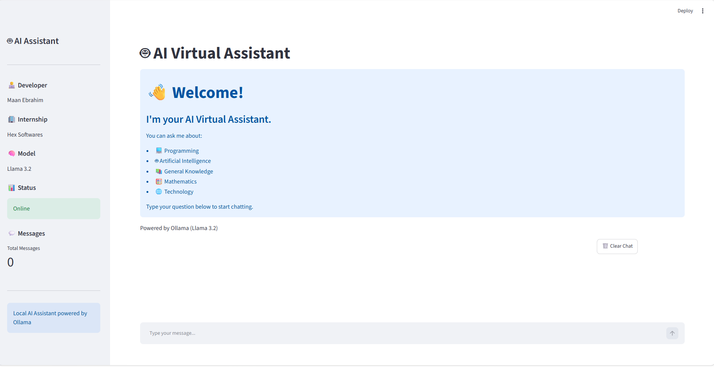
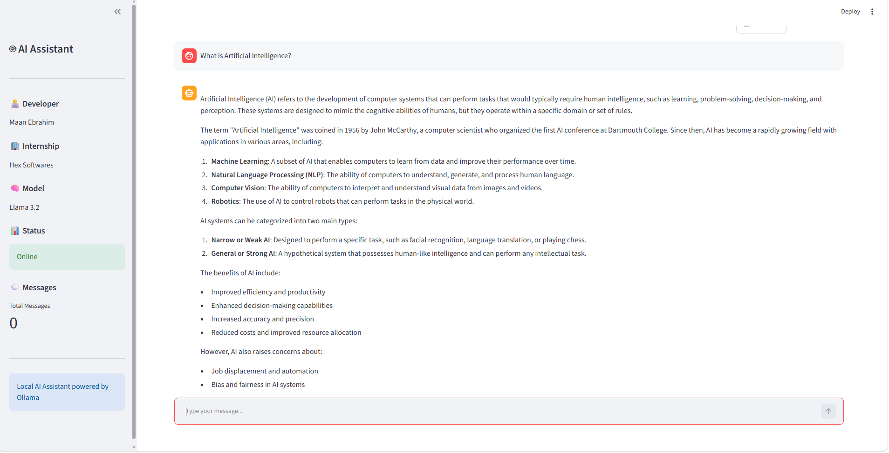
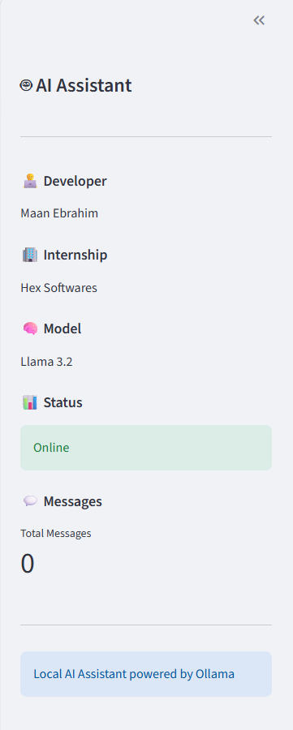

# AI Virtual Assistant

AI Virtual Assistant built with Python and Streamlit.

## Features
- Chat interface
- Local AI model using Ollama
- Streamlit web interface
- Simple and clean UI

## Installation

```bash
pip install -r requirements.txt
streamlit run app.py
```

## Screenshots

### Home


### Chat


### Sidebar

